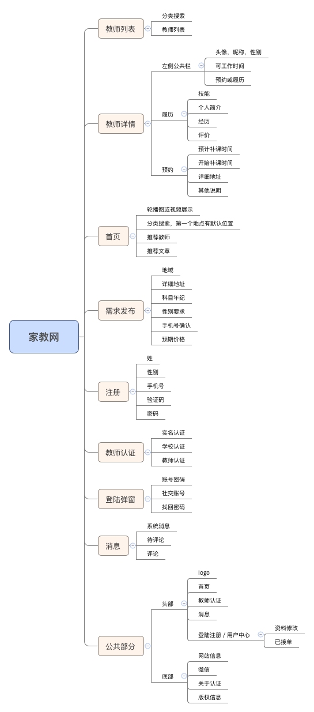
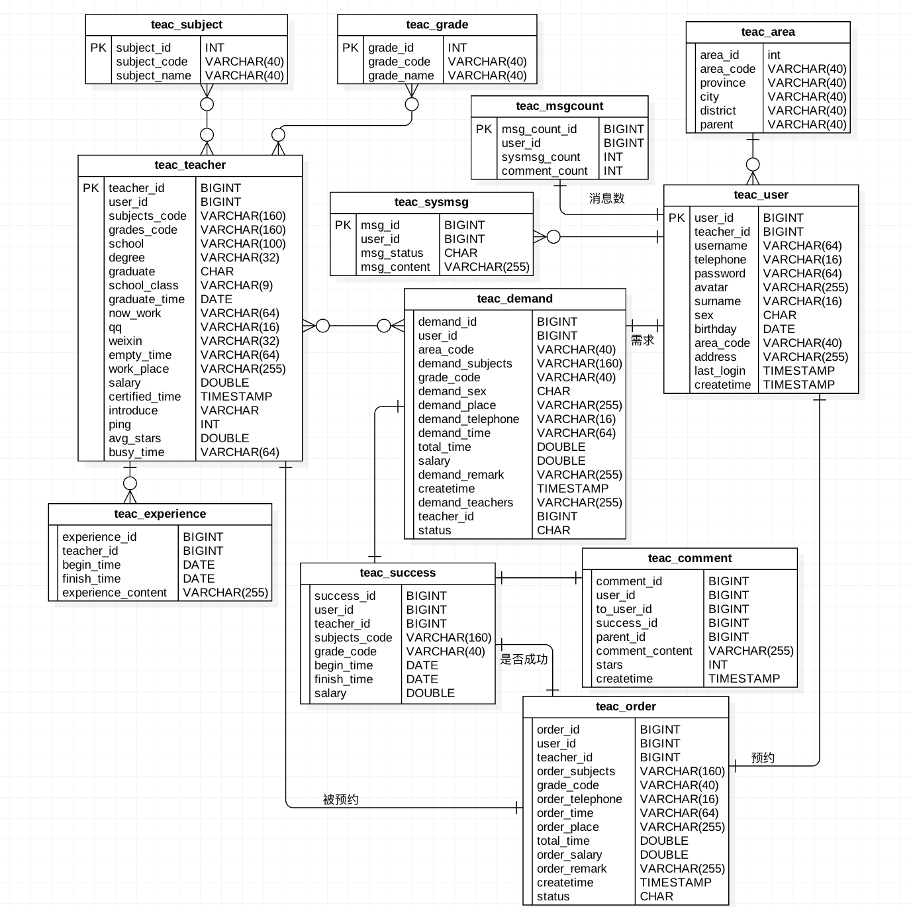
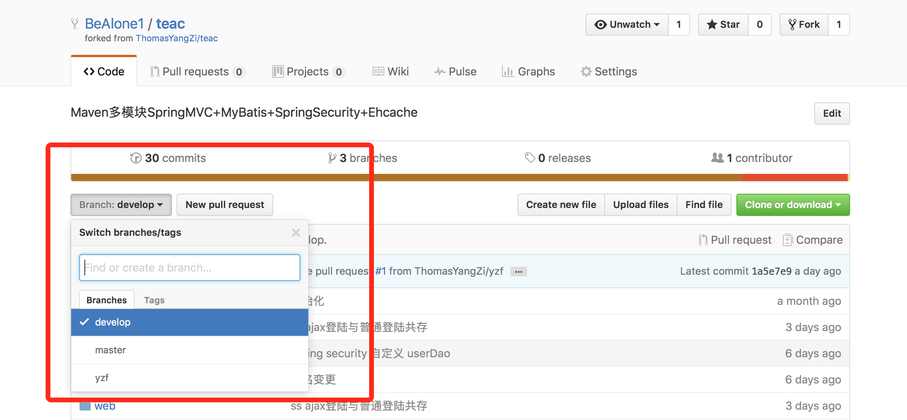
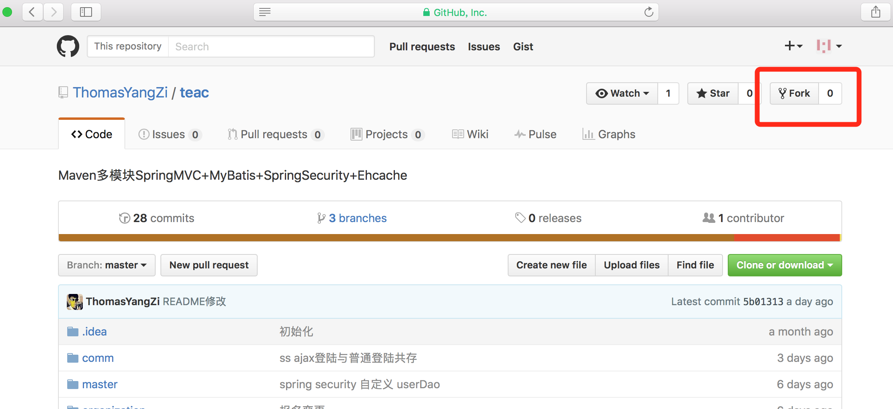
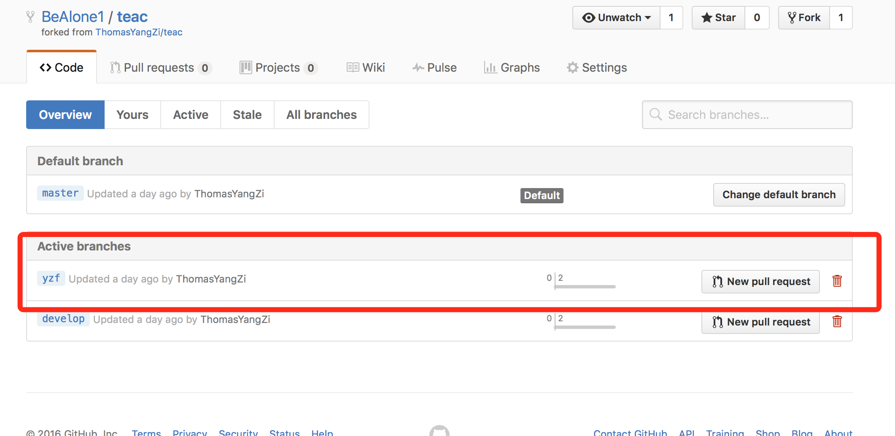
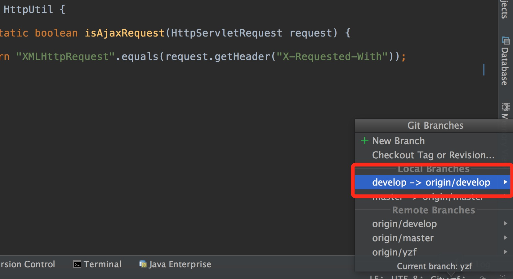

# 家教网：沟通家长与教师

家教网是开始于**2016年11月**的一个沟通家长与孩子的项目，使用`Java`语言开发，主要面向人群是一二三线城市的义务教育家庭的家长与孩子、在职教师、想要兼职教师的大学生。

项目地址：https://github.com/ThomasYangZi/teac
### 使用技术
Java8 + Tomcat8
1. 框架：
  + Spring 4.2.2.RELEASE
  + SpringMVC 4.2.2.RELEASE
  + Mybatis 3.2.6
  + Jackson 2.4.4
  + Spring Security 4.0.3.RELEASE
  + Quartz
  + JQuery
2. 数据库
  + Mysql 5.7
  + Redis 3.0.3

### 项目概要设计
1. 系统模块
  + comm模块：基础的工具类
  + master模块：用户端的业务
  + organization模块：管理员与机构的业务
  + web模块：控制层和显示层

2. 前台需求
    + 用户的注册 -> teac_user
    + 教师的认证 -> teac_teacher
    + 教师的展示与详情 -> teac_user & teac_teacher & teac_experience
    + 需求的发布 -> teac_demand
    + 家教预约 -> teac_order
    + 成功服务与评论 -> teac_success & teac_comment
    + 地域、科目、年级分类查找 -> teac_area & teac_subject & teac_grade

3. 后台需求（审查：增删查改）
    + 用户与教师的审查 -> teac_user & teac_teacher
    + 需求信息的审查 -> teac_user & teac_demand
    + 预约信息的审查 -> teac_user & teac_teacher & teac_order
    + 成功预约的审查 -> teac_success
    + 评论的审查 -> teac_comment
    + 权限管理 -> admin_role & admin_user_role
    + 消息模版 -> msg_template
    + 日志管理 -> admin_log
    + 文章的添加 -> article & article_desc
    + 底部链接 -> friend_link
    + 机构的认证 -> organ_user
    + 调度任务的执行

### 详细设计
##### 1.产品实现功能概要

##### 2.数据库设计
> 展示E-R图

##### 3.权限设计

>占位

##### 4.详细功能

1. comm
  - DateUtil:各种格式时间的转换，输入：字符串,Date,TimeStamp;输出：Date,TimeStamp/String
  - JsonUtil:返回结果的装配，json、xml的解析
  - TelUtil: 手机短信的收发
  - MailUtil:邮件的收发
  - Location:根据IP定位

2. master
  - 注册：普通用户的注册：输入：teac_user表除了teacher_id的其他字段，有默认值可以省略
  - 登陆：普通用户的登陆：输入：手机／username、password 输出：Session(user),Cookie(area_code),SysCount
  - 认证：教师的认证：输入：Session(user),teac_teacher表certified_time以上,输出：teacher
  - 需求发布：输入：Session(user)、demand表。

3. organization
>占位
4. web
>占位

### 加入我们

如何加入：给我发邮件`yzf@kiviblog.com`或者在**几维小组**公众号留言

---

# 协作规范
### organ teac简介

>teac项目一共3个分支

+ `master`为主分支，用来发布可以运行的家教网版本
+ `develop`为项目开发分支，用来合并每个人的代码
+ `yzf`为我用来开发的分支

example：我先将代码`clone`到`IDEA`里，这里IDEA只默认的将`master`主分支clone到本地。现在将`develop`和`yzf`分支`check out`到本地，
在`IDEA`里选择`yzf`分支，进行开发，在开发一段时间休息是先将代码`commit`到本地git仓库，再多次开发完成一个下的功能模块时（比如注册)，就`push`到github远程的`yzf`分支。然后再次检查代码，发现bug，也可给伙伴查看，确定没问提，就`merge`合并`yzf`分支到`develop`分支，并等待其他伙伴的`PULL REQUEST`。
等一个大的模块（比如用户模块，包括注册，登陆，信息获取）小伙伴们一起完成后，并每个人都测试通过后，就`merge`分支`develop`到`master`。

<strong>注：</strong>
1. 这里的分支都是主仓库`organ`下的分支
2. 具体在IDEA里如何操作，会在下面给出图解

### 加入开发组
1. fork `organ` teac项目到自己的github 地址：https://github.com/ThomasYangZi/teac

2. 删除`yzf`分支(这里fork会默认显示和`organ`相同的3个分支)

>yzf这个分支可以删除，是我的开发分支，平时开发可以在develop分支进行，确定好的代码可以合并到master主分支，
再由master`PULL REQUEST`到`origin`主仓库的`develop`。

3. `clone`自己仓库里的`teac`项目到IDEA（IDE clone方法自行搜索）

4. `checkout`分支`develop`(默认`clone`只会`checkout`主分支`master`)
CVS -> Git -> branches

5. 选择develop，进行开发

### 提交代码流程

>假设qwj已经完成了上边步骤，fork了代码到IDEA里

1. 在`develop`分支更改`README.md`文件
在最后一行添加了qwj加入开发
2. `commit and push`分支`develop`到远程仓库github
3. 在确定无误后等录github，切换到`develop`下发现README已经更改，并看到如下图

这里暂时不需要`pull request`到`master`分支,先要将自己github仓库的`master`和`organ`的develop同步了，因为在修改README文件过程中，`organ`的`develop`接收了其他开发者的代码，已经发生了改变。
4. 接下来就是`pull request`自己仓库的`develop`到`master`。如果没有冲突直接提交，如果有冲突就要对照冲突将自己的代码做出调整。如下图，发生了冲突，所以在IDEA里先将`master`的代码拉`pull`下来，然后在IDEA里和`develop`分支对比，修改。这个时候有问题可以交流，并不一定非要自己改，也可以让`organ`主仓库改。
5. 修改后再次`pull request`到`master`，没有问题后在切换到`master`分支，将`master`分支`pull request`到`organ`主仓库的`develop`分支。

### 注意
+ organ/master 对应 发布版
+ organ／develop 对应 master
+ develop 是自己开发的分支，就想organ／yzf一样，不对团队产生影响
+ 如果有自己开发的小功能，但没有被团队采纳，可以建立自己的其他分支
+ 开发过程中多交流

