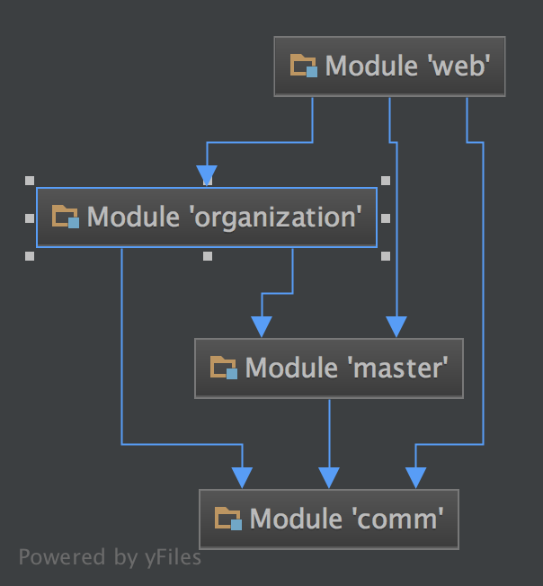

#TEAC 概要设计

##总体设计：
####1.主要需求：
1. 前台需求

    + 用户的注册 -> teac_user 
    + 教师的认证 -> teac_teacher
    + 教师的展示与详情 -> teac_user & teac_teacher & teac_experience
    + 需求的发布 -> teac_demand
    + 家教预约 -> teac_order
    + 成功服务与评论 -> teac_success & teac_comment
    + 地域、科目、年级分类查找 -> teac_area & teac_subject & teac_grade

2. 后台需求（审查：增删查改）

    + 用户与教师的审查 -> teac_user & teac_teacher
    + 需求信息的审查 -> teac_user & teac_demand
    + 预约信息的审查 -> teac_user & teac_teacher & teac_order
    + 成功预约的审查 -> teac_success
    + 评论的审查 -> teac_comment
    + 权限管理 -> admin_role & admin_user_role
    + 消息模版 -> msg_template
    + 日志管理 -> admin_log
    + 文章的添加 -> article & article_desc
    + 底部链接 -> friend_link
    + 机构的认证 -> organ_user
    + 调度任务的执行 
    
####2.系统设计：
1. comm模块：基础的工具类
2. master模块：用户端的entity，dao，service
3. organization模块：管理员与机构的entity，dao，service
4. web模块：控制层和显示层

    
##外部接口
- jdk 1.8.0.101
- tomcat 8.0.39
- mysql 5.7
    
+ Servlet 3.1
+ Spring 4.1.7.RELEASE
+ SpringMVC 4.1.7.RELEASE
+ Mybatis 3.2.6
+ Spring Security 4.0.3.RELEASE
+ ehcache 2.9.0
+ Log4j 1.2.17

##系统模块
#####comm
- DateUtil:各种格式时间的转换，输入：字符串／Date,TimeStamp;输出：Date,TimeStamp/String
- JsonUtil:返回结果的装配，json、xml的解析
- TelUtil: 手机短信的收发
- MailUtil:邮件的收发
- Location:根据IP定位

#####master

- 注册：普通用户的注册：输入：teac_user表除了teacher_id的其他字段，有默认值可以省略
- 登陆：普通用户的登陆：输入：手机／username、password 输出：Session(user),Cookie(area_code),SysCount
- 认证：教师的认证：输入：Session(user),teac_teacher表certified_time以上,输出：teacher
- 需求发布：输入：Session(user)、demand表。

#####organization

#####web
1. 权限：
    - 

    

    
    

    

    
